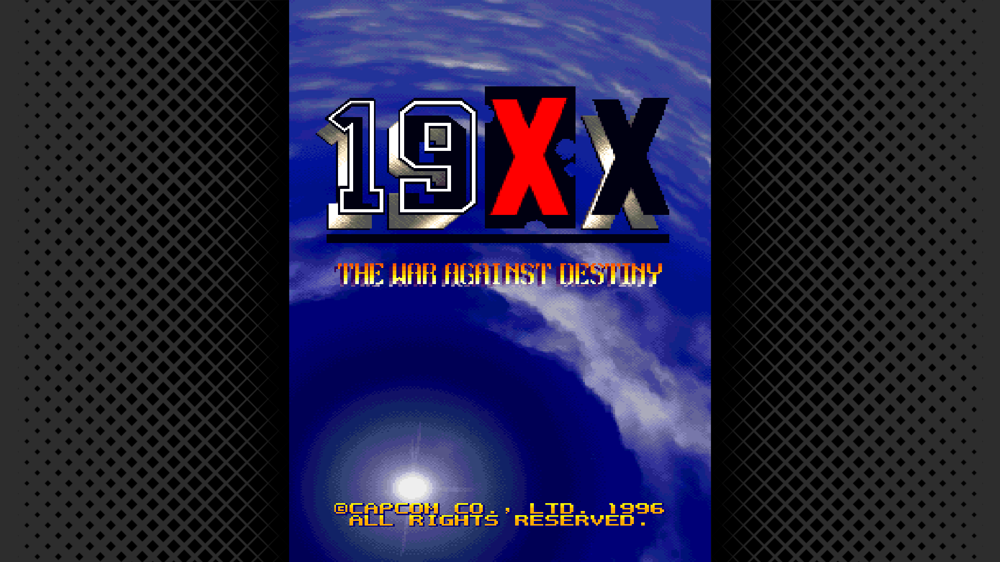
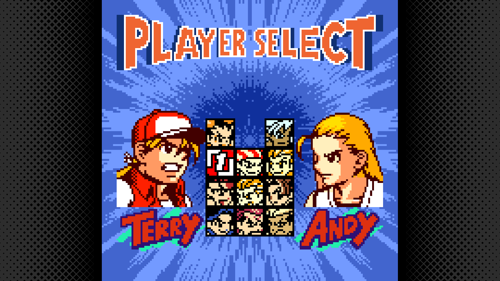
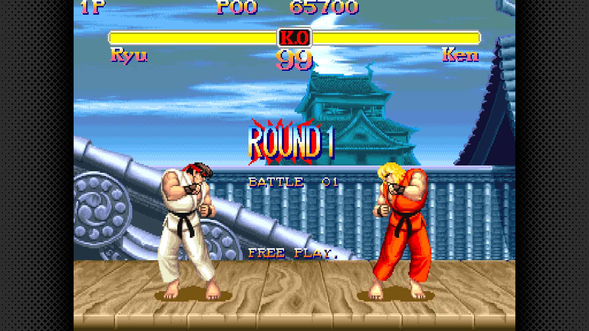

# Arcade & Console Bezels Project

This project was inspired by **NSO Bezels**. I took the halftone pattern and, using **GIMP**, made adjustments to create:

- **Horizontal bezels** for arcade and console games  
- **Vertical bezels** for shoot 'em ups (e.g., *Gunbird*, *Battle Garegga*)  
- **Portable bezels** for systems like the *NeoGeo Pocket Color*  

---

## 📂 Project Contents

- 🎨 The GIMP source file  
- 🖼️ PNG bezel images  
- ⚙️ Config files for RetroArch  

---

## 🚀 Future Plans

I’d like to develop a script that automatically sets up bezels based on the **core** or the **orientation** of the game.  
This would make configuration much easier, especially on **Lakka**.

---

## 📸 Screenshots

19XX - The War Against Destily

Fatal Fury - F Contact

Super Street Fighter II Turbo

---

## 🙌 Credits

Inspired by **NSO Bezels** and adapted for broader use across arcade, console, and portable systems.